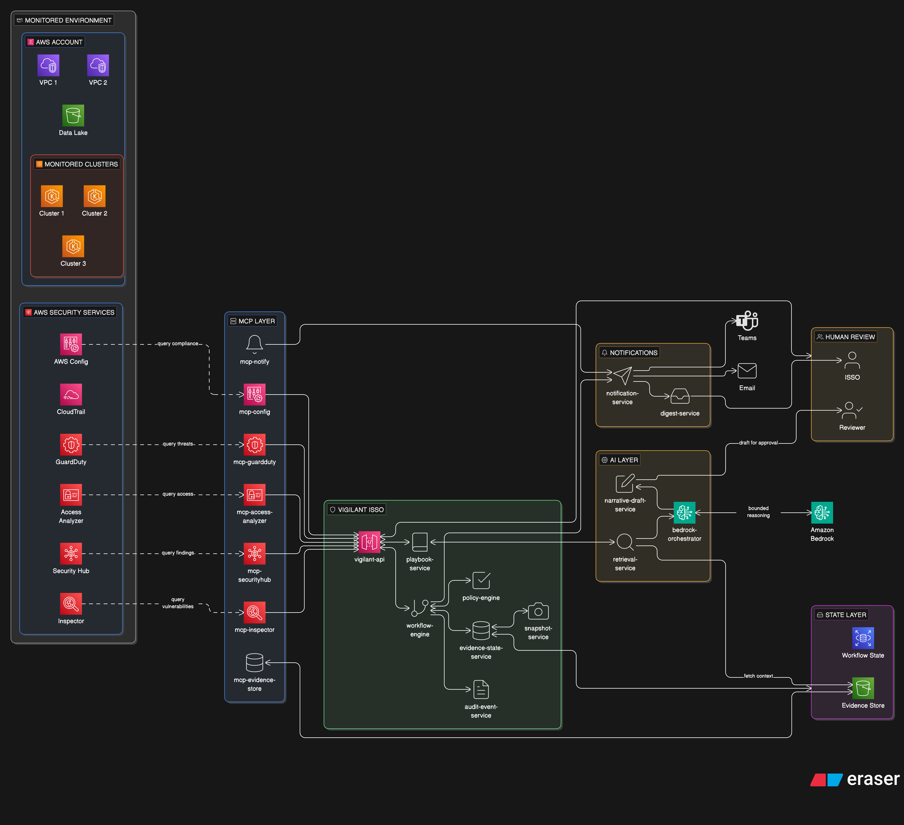

# Vigilant ISSO

## Concept

Vigilant ISSO is a governed security and compliance operations concept for **AWS GovCloud and on-prem CMMC Level 2 environments**.

The current direction is intentionally lean:

**a small EKS-hosted ISSO operations control service that uses MCP-style integrations to monitor a bounded environment, preserve evidence/workflow truth, and help humans stay ahead of compliance drift.**

This is deliberately different from building a giant platform first.

---

## Why this project exists

ISSO work is full of repetitive, high-friction tasks such as:
- reviewing findings
- mapping issues to controls
- gathering and organizing evidence
- tracking POA&Ms
- identifying stale artifacts
- following up on remediation owners
- checking drift against approved baselines
- preparing audit support packages
- translating technical findings into compliance language
- comparing policy claims against operational reality

Vigilant ISSO exists to reduce that tedium while keeping evidence, provenance, and human judgment intact.

---

## Current architecture direction

The current preferred architecture is:
- **one small EKS-hosted Vigilant ISSO runtime**
- **MCP-style pods/services** to interact with AWS-native security and compliance services
- **lightweight persistent workflow/evidence state**
- **object-backed evidence storage**
- **Teams/email notifications** inside the boundary
- **optional bounded Bedrock reasoning** for summaries and playbook assistance

### Important distinction
The AWS account, VPCs, data lake, and EKS clusters discussed in the prototype docs are the **environment being monitored**.
They are **not** the full infrastructure footprint Vigilant ISSO itself needs to run.

That distinction is now central to the project.

---

## First bounded prototype scope

The current prototype is focused on monitoring exactly:
- **1 AWS account**
- **2 VPCs**
- **1 data lake**
- **3 small EKS clusters**

The prototype is meant to prove that Vigilant ISSO can provide real ISSO value for one environment before expanding into a bigger platform story.

---

## What Vigilant ISSO should do

### 1. Posture monitoring
- ingest findings from AWS-native security and audit services
- identify drift from expected baselines
- correlate issues by system, owner, control family, and severity

### 2. Control-aware reasoning
- map technical findings to:
  - NIST SP 800-171
  - CMMC L2 practices/domains
  - NIST SP 800-53 families where useful
  - AWS guidance / GovCloud realities
  - internal policy references

### 3. Evidence management
- organize evidence artifacts by control/system/date
- identify stale, missing, or weak evidence
- preserve provenance and source references
- support evidence bundle generation for review/audit

### 4. Remediation / POA&M support
- create and update remediation items
- track owners, due dates, status, and aging
- summarize overdue or high-risk items
- support POA&M-like workflows and reporting

### 5. Audit readiness
- generate control summaries
- prepare briefing views by control family/system/environment
- identify mismatches between documented posture and observed reality
- produce reviewable, source-backed narratives

### 6. Human-in-the-loop compliance ops
- support analysts and ISSOs
- never claim final compliance authority
- always distinguish:
  - verified facts
  - inferred analysis
  - recommendations
  - unresolved questions

---

## Design principles

- evidence first
- citations over vibes
- AWS-native where practical
- lean control plane first
- MCP-mediated integrations
- human review for consequential conclusions
- auditable by default
- least privilege for integrations
- no fake “you are compliant” output
- continuous evaluation over point-in-time theater
- drift detection must lead to governed remediation, not just alerting
- derivative summaries never replace primary evidence
- decisions should preserve enough provenance to survive an assessor challenge

## Governance posture

Vigilant ISSO is intended to reflect disciplined ISSO/CISO operating behavior, not just automation enthusiasm.

That means the project assumes:
- **NIST-oriented assessment rigor** using evidence, review, and recurring evaluation patterns compatible with SP 800-171, SP 800-171A, and OSCAL-style traceability.
- **AWS Well-Architected alignment** with explicit attention to Security, Reliability, Operational Excellence, and Cost Optimization tradeoffs.
- **drift and remediation discipline** where baseline changes, stale evidence, and recurring findings become governed actions with owners, due dates, and closure validation.
- **evidence quality controls** that distinguish raw source artifacts, normalized metadata, and AI- or analyst-produced derivative narratives.
- **human approval for consequential outcomes** such as exception approval, readiness publication, and closure of materially significant issues.

---

## Current project documents

- `research-plan.md` — verified facts, assumptions, priority ISSO tasks, and research direction
- `architecture-options.md` — viable platform shapes and tradeoffs
- `control-mapping.md` — how findings/evidence map to CMMC L2 / NIST SP 800-171
- `evidence-model.md` — canonical evidence/provenance data model
- `poam-workflow.md` — remediation and POA&M lifecycle
- `audit-readiness.md` — readiness snapshots, evidence packets, and reporting model
- `continuous-assessment-model.md` — continuous-control review, anti-drift model, and recurring assessment cadence
- `runbooks-and-playbooks.md` — concrete ISSO runbooks and guided human-in-the-loop playbooks
- `notification-model.md` — Teams/email routing, escalation logic, and policy caveats
- `first-10-automations.md` — the first ten automations worth implementing
- `control-health-scoring.md` — multi-dimensional control-health model
- `eks-architecture.md` — earlier EKS-heavy architecture exploration (superseded directionally by the lean architecture in `Architecture.md`)
- `implementation-roadmap.md` — phased build plan from concept to MVP, pilot, and controlled expansion
- `eks-component-backlog.md` — earlier EKS service/component backlog exploration
- `mvp-prototype-scope.md` — exact prototype scope for the lean first environment
- `terraform-module-map.md` — Terraform module/repo map for the lean prototype runtime
- `helm-topology.md` — Helm release model for the lean prototype runtime
- `sprint-1-backlog.md` — practical sprint-1 backlog focused on the first end-to-end platform spine
- `prototype-success-criteria.md` — how to judge whether the first bounded prototype actually worked
- `Architecture.md` — updated drawing-ready technical architecture spec for the current lean direction
- `vigilant-isso.png` — current technical architecture drawing derived from `Architecture.md` (should be refreshed to match the revised architecture)
- `day-in-the-life-of-vigilant-isso.md` — operational narrative showing what the system does and how the team interacts with it
- `first-environment-cost-model.md` — tighter cost model for the current lean first-environment direction
- `one-week-mvp-cost-model-us-gov-west-1.md` — one-week AWS GovCloud MVP run-cost model for gathering stats
- `one-week-mvp-bom-cost-table-us-gov-west-1.md` — bill-of-materials style weekly AWS cost table for the MVP
- `seven-day-budget-profile-us-gov-west-1.md` — recommended 7-day GovCloud deployment posture, budget target, and day-by-day evaluation profile
- `mvp-cost-guardrails-checklist.md` — practical checklist for keeping the MVP from drifting upward in spend
- `mvp-scorecard.md` — weighted evaluation framework for judging runtime quality, documents, drift detection, remediation behavior, operator usefulness, and cost discipline
- `rom-cost-and-implementation-plan.md` — high-level ROM and implementation framing, now updated to point to the lean direction
- `pitch.md` — sharper product narrative and positioning
- `security-assurance-pipeline.md` — GitLab CI security pipeline, SBOM, and security vulnerability reporting guidance for this repo
- `.gitlab-ci.yml` — GitLab pipeline for inventory, Terraform checks, tfsec, checkov, trivy, bandit, SBOM generation, and report indexing

## Architecture Diagram

The diagram above reflects the updated lean MCP-based architecture described in `Architecture.md`.

## CI / security checks for this repo

This repository now includes a **GitLab CI pipeline** in `.gitlab-ci.yml` with the following stages:
- **inventory** — detect whether Terraform, Python, or Docker-relevant inputs exist
- **validate** — `terraform fmt` and `terraform validate` when Terraform is present
- **security** — `tfsec`, `checkov`, `trivy`, and `bandit` where applicable
- **sbom** — CycloneDX SBOM generation via Trivy
- **report** — artifact indexing for reviewer-friendly retrieval

### Current repository reality
- no Terraform files were present when the pipeline was added
- no Python files were present when the pipeline was added
- no Dockerfiles were present when the pipeline was added

The pipeline therefore records explicit skip evidence for Terraform- or Python-specific jobs instead of pretending the checks ran. The Docker absence is documented so future contributors can extend the pipeline intentionally if container build assets are introduced.

### Security reporting expectations
Pipeline outputs are meant to support **security vulnerability reporting (SVR)** and governed remediation, not auto-approval. Findings should be reviewed, normalized into tracked work, assigned to an owner, and closed only with validation evidence.

See `security-assurance-pipeline.md` for the operating model and artifact details.

## Notes on rigor

The project docs deliberately separate:
- **verified facts** from official sources
- **working assumptions** and design opinions

That matters because the whole concept only works if the platform is trusted as disciplined infrastructure, not compliance theater.
